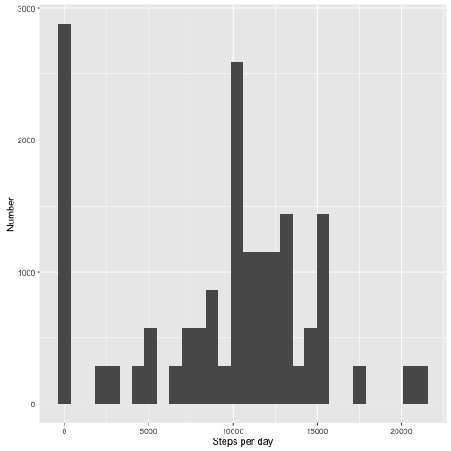
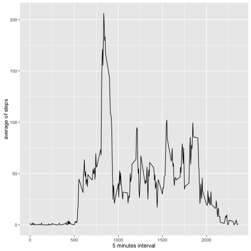
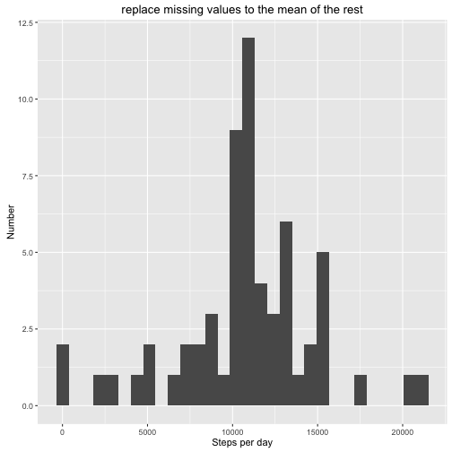
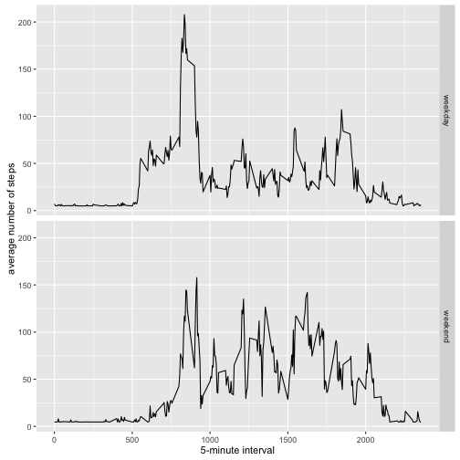

Reproducible Research Peer Assignment 1
=======================================

##Loading the packages

```r
library(ggplot2)
```

```
## Warning: package 'ggplot2' was built under R version 3.2.4
```

```r
library(lubridate)
```

```
## Warning: package 'lubridate' was built under R version 3.2.4
```

```
## 
## Attaching package: 'lubridate'
```

```
## The following object is masked from 'package:base':
## 
##     date
```

```r
library(Hmisc)
```

```
## Warning: package 'Hmisc' was built under R version 3.2.5
```

```
## Loading required package: lattice
```

```
## Loading required package: survival
```

```
## Loading required package: Formula
```

```
## 
## Attaching package: 'Hmisc'
```

```
## The following objects are masked from 'package:base':
## 
##     format.pval, round.POSIXt, trunc.POSIXt, units
```


##Loading and preprocessing the data

###1. Load the data(i.e. read.csv())


```r
if (!file.exists("activity.csv")){
    unzip("repdata%2Fdata%2Factivity.zip")
}
activity = read.csv("activity.csv")
```

###2. Process/transform the data(if necessary) into a format suitable for your analysis


```r
activity$date = ymd(activity$date)
```


##What is the mean total number of steps taken per day?

###1.Calculate the total number of steps taken per day and plot it in histogram by qplot

```r
activity$steps_per_day = tapply(activity$steps, activity$date, sum, na.rm=TRUE)
qplot(activity$steps_per_day, xlab="Steps per day", ylab = "Number")
```

```
## `stat_bin()` using `bins = 30`. Pick better value with `binwidth`.
```



###2. Calculate and report the mean and median of the total number of steps taken per day


```r
steps_Mean=mean(activity$steps_per_day)
steps_median=median(activity$steps_per_day)
steps_Mean
```

```
## [1] 9354.23
```

```r
steps_median
```

```
## [1] 10395
```


##What is the average daily activity pattern?

###1. Make a time series plot


```r
average = aggregate(x=list(mean_steps= activity$steps), by = list(interval=activity$interval), FUN=mean, na.rm=TRUE)
ggplot(data=average, aes(x=interval, y= mean_steps))+ geom_line()+xlab("5 minutes interval")+ylab("average of steps")
```



###2. Which 5-minute interval, on average across all the days in the dataset, contains the maximum number of steps?


```r
most = which.max(average$mean_steps)
time_most_steps = gsub("([0-9]{1,2})([0-9]{2})", "\\1:\\2", average[most,"interval"])
time_most_steps
```

```
## [1] "8:35"
```


##Imputing missing values
###1. Calculate and report the totla number of missing values in the dataset

```r
num_missing_value =length(which(is.na(activity$steps)))
num_missing_value
```

```
## [1] 2304
```

###2. Devise a strategy for filling in all of the missing valuers in the dataset: filling mean to NA.

###3. Create a new dataset that is equal to the original dataset but with the missing data filled in

```r
new_activity = activity
new_activity$steps= impute(activity$steps, fun=mean)
```

###4. Make a histogram of the total number of steps taken each day and claculate and report the mean and median total number of steps taken per day.


```r
new_steps_per_day = tapply(new_activity$steps,new_activity$date, sum )
qplot(new_steps_per_day, xlab = "Steps per day", ylab = "Number", main = "replace missing values to the mean of the rest")
```

```
## `stat_bin()` using `bins = 30`. Pick better value with `binwidth`.
```



```r
new_steps_Mean= mean(new_steps_per_day)
new_steps_median=median(new_steps_per_day)
new_steps_Mean
```

```
## [1] 10766.19
```

```r
new_steps_median
```

```
## [1] 10766.19
```

##Are there difference in activity patterns between weekdays and weekends?

###1. Create a new factor variable in the data set with two levels


```r
new_activity$date_type = ifelse(as.POSIXlt(new_activity$date)$wday %in% c(0,6), "weekend", "weekday")
```

###2. Make a penal plot containing a time series plot


```r
new_average = aggregate(steps~interval+date_type, data=new_activity, mean)
ggplot(new_average, aes(interval, steps)) + geom_line()+facet_grid(date_type~.)+ xlab("5-minute interval") + ylab("average number of steps")
```


